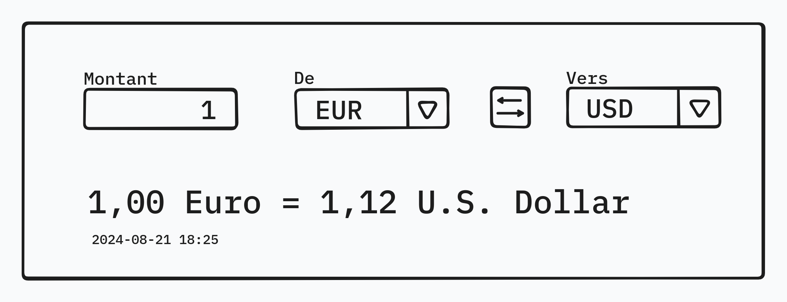

# Currency rate calculator

The goal of this exercise is to create a simple currency converter.

## Setup

Make sure to install the dependencies:

```bash
yarn install
```

Start the development server with:

```bash
yarn dev
```

The command will provide you the url to use to open the app.

## To do



**Implement a currency converter.**

- Use the following service to get exchange rates against the _euro_: https://www.floatrates.com/daily/eur.json.  
  The content of this file must not be saved in the repository, it must be used online as an API.
- Select a source currency and a target currency, from those available in the list returned by the API.
- In the currency selectors, display only the currency code. In the result below, display the currency full name. Both of these data are provided by the API (except `Euro`/`EUR`).
- The date is the rate date. Must be displayed with `yyyy-mm-dd hh:mm` format.
- Clicking on the button between the currency selectors must switch the source and the target, and update the result.

Once you're done, submit your work by making a pull request.

**Optional:**

- Features:
  - The result should update when you type the amount (no submit button)
  - Do anything you want! Can be features (ex: a conversion history list), style (ex: dark mode), or anything else.
- Technical:
  - Commit and push your progress
  - Use [Vuetify](https://vuetifyjs.com/) components
  - Use [Nuxt 3](https://nuxt.com/docs/getting-started/introduction) features
